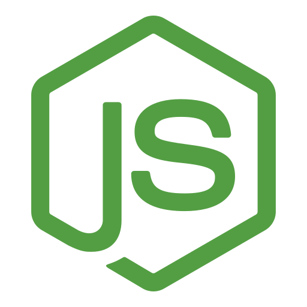
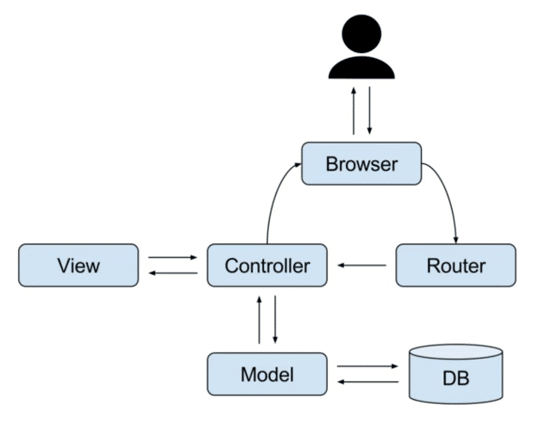

    <h1>PHP Laravel</h1>
    <h3>
        <a href="/">
            Live demo
        </a>
         | 
        <a href="https://github.com/chriskodehub/KH-15_calculator">
            GitHub
        </a>
    </h3>
    
Zadanie domowe - laboratorium

         
        
Technologies and tools:

    

        
        
        
        
        
        
        
        
         
        
        
        
        
        
        
        
        
    

 

### POCZĄTKOWA KONFIGURACJA

1. Skonfigurować plik .gitignore dodając wykluczenia dla moich folderów _tmp i _resources
2. Połączyć projekt z GitHub i zrobić `initial commit`
3. `composer self-update` - updatować composer
4. `composer install` - zainstalować wszystkie potrzebne pakiety
5. `composer update` - robi update wszystkich zainstalowanych pakietów
6. `php artisan migrate` - uruchomić migrację

### AUTOMATYCZNE ODŚWIEŻANIE STRONY

1. https://stackoverflow.com/questions/49392001/laravel-project-auto-refresh-after-changes
2. `npm install` - instaluje wszystkie pakiety z pliku package.json
3. `mix.browserSync('127.0.0.1:8000');` - dodać na końcu pliku webpack.mix.js
4. `php artisan serve` - najpierw uruchomić serwer artisan
5. `npm run watch` - po uruchomieniu Webpack za pierwszym razem zostaną zainstalowane potrzebne zależności. Po drugim uruchomieniu wszystko będzie działało.

### JS i CSS KOMPILOWANY ZA POMOCĄ WEBPACK

1. `materialize.js` kompilowany jest do app.js za pomocą Webpack. Szczegóły konfiguracji w pliku `resources\js\app.js`.
2. `materialize.css` kompilowany jest do app.css za pomocą Webpack. Szczegóły konfiguracji w pliku `resources\css\app.css`.
3. `validator.js` kompilowany jest do validator.js za pomocą Webpack.
4. Konfiguracja Webpack w pliku `wepack.mix.js`
5. Najpierw trzeba skonfigurować i odpalić `Automatyczne odświeżanie strony`.

### MVC

    

